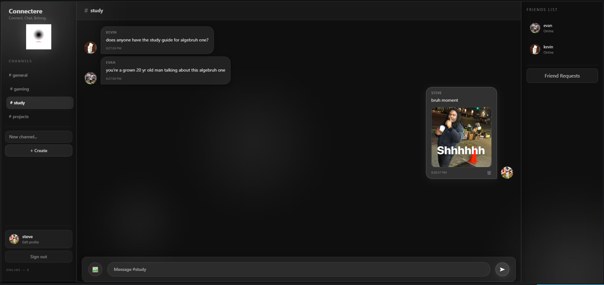

# Connectere 
> *Connect, Chat, Belong.*



Connectere is a real-time chat platform build for people who want to join communities or build one. Whether you're planning hangouts or coordinating with a teamp;
Connectere gives you organized channels, instant messaging, and a social layer all in one place. Create or join rooms, share images, stay connected with a friends list.
It's fast, clean, and built to feel like a community.

---

## Features

- Register / login with JWT authentication
- Real-time messaging with Socket.io
- Create and join channels
- Image sharing in chat
- Typing indicators and online user list
- Friend requests and friends list
- Profile customization (avatar, bio, status)
- Mobile responsive layout

---

## Architecture

| | |
|---|---|
| Frontend | React (Vite), Tailwind CSS |
| Real-time | Socket.io |
| Backend | Node.js, Express |
| Database | MongoDB, Mongoose |
| Auth | JWT, bcrypt |
| File Upload | Multer |

---

## Running Locally

**Backend**
```bash
cd server
npm install
```
Create a `.env` file:
```env
PORT=5000
MONGO_URI=your_mongodb_uri
JWT_SECRET=your_secret
```
```bash
npm run dev
```

**Frontend**
```bash
cd client
npm install
npm run dev
```

App runs at `http://localhost:5173`, backend at `http://localhost:5000`.
